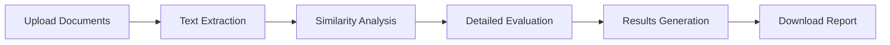

<div align="center">

# 🧞‍♂️ Grade-Genie

[](https://gradegenie.streamlit.app/)
[](https://www.python.org/downloads/)
[](https://opensource.org/licenses/MIT)
[](https://deepmind.google/technologies/gemini/)

> *Your AI-powered companion for automated exam evaluation*


[Demo](https://gradegenie.streamlit.app/) • [Documentation](#) • [Report Bug](#) • [Request Feature](#)

</div>

## 🌟 Features

### 🤖 AI-Powered Evaluation
- **Smart Text Extraction**: Automatically extracts text from scanned answer scripts
- **Intelligent Scoring**: Computes similarity scores based on multiple evaluation criteria
- **Detailed Analysis**: Provides comprehensive feedback on each answer

### ⚡ Real-Time Processing
- **Concurrent Processing**: Evaluates multiple answer scripts simultaneously
- **Progress Tracking**: Live progress indicators and processing time statistics
- **Instant Results**: View evaluation results as they are completed

### 📊 Comprehensive Reports
- **Similarity Scores**: Visual representation of answer matching
- **Detailed Feedback**: Specific areas of improvement and mistakes
- **Downloadable Results**: Export evaluations in JSON format

## 🚀 Getting Started

### Prerequisites

- Python 3.8 or higher
- Gemini API key ([Get it here](https://deepmind.google/technologies/gemini/))

### Installation

1. Clone the repository:
```bash
git clone https://github.com/yourusername/grade-genie.git
cd grade-genie
```

2. Install required packages:
```bash
pip install -r requirements.txt
```

3. Set up your Gemini API key:
   - Create `.streamlit/secrets.toml` file
   - Add your API key:
     ```toml
     Gemini_API_Token = "your-api-key-here"
     ```

4. Run the application:
```bash
streamlit run app.py
```

## 💡 Usage

1. **Upload Documents**
   - Add student answer scripts (PDF/JPG/JPEG/PNG)
   - Upload evaluation scheme document

2. **Start Evaluation**
   - Click "Evaluate Answer Scripts"
   - Watch real-time processing
   - View results as they appear

3. **Review Results**
   - Examine similarity scores
   - Read detailed evaluations
   - Download comprehensive reports

## 🛠️ Technical Architecture



## 📦 Project Structure

```
grade-genie/
├── app.py              # Main Streamlit application
├── requirements.txt    # Project dependencies
├── .streamlit/        # Streamlit configuration
│   └── secrets.toml   # API keys and secrets
└── README.md          # Project documentation
```

## 🔑 Environment Variables

Required environment variables in `.streamlit/secrets.toml`:

```toml
Gemini_API_Token = "your-api-key-here"
```

## 🤝 Contributing

Contributions are welcome! Here's how you can help:

1. Fork the Project
2. Create your Feature Branch (`git checkout -b feature/AmazingFeature`)
3. Commit your Changes (`git commit -m 'Add some AmazingFeature'`)
4. Push to the Branch (`git push origin feature/AmazingFeature`)
5. Open a Pull Request

## 📝 License

Distributed under the MIT License. See `LICENSE` for more information.

## 🙏 Acknowledgments

- [Streamlit](https://streamlit.io/) for the amazing web framework
- [Google Gemini](https://deepmind.google/technologies/gemini/) for powerful AI capabilities
- [Pillow](https://python-pillow.org/) for image processing

---

<div align="center">

Made with ✌🏻 by [Harshavardhan M](https://www.linkedin.com/in/harshavardhan-md)

[⬆ Back to Top](#-grade-genie)

</div>
